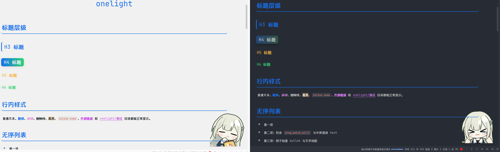

# onelight-siyuan

An unofficial dual-mode SiYuan theme that ports Typora's `onelight` and `onelight-dark` to SiYuan.

## Highlights

- Adapted to SiYuan's native DOM instead of directly copying Typora selectors
- Ships both light and dark modes in a single package
- Covers editor content, headings, lists, blockquotes, tables, inline code, and code blocks
- Includes toolbar, tabs, file tree, dialog, and menu styling
- Preserves the original decorative character image and bundled fonts used by the upstream Typora theme

## Upstream

- Original theme: <https://github.com/caolib/typora-onelight-theme>
- This repository is an unofficial adaptation for SiYuan and is not affiliated with the original author

## License and Asset Notice

- The upstream Typora theme repository declares the WTFPL license
- This adaptation is distributed on top of that upstream license context
- Some decorative image assets are carried over from the upstream theme for compatibility with the original look
- If the original author or any relevant rights holder objects to the inclusion of those assets, please open an issue in this repository and they will be removed

## Installation

Install from the SiYuan Bazaar after publication, or manually download `package.zip` from the GitHub Release page and import it as a theme package.
